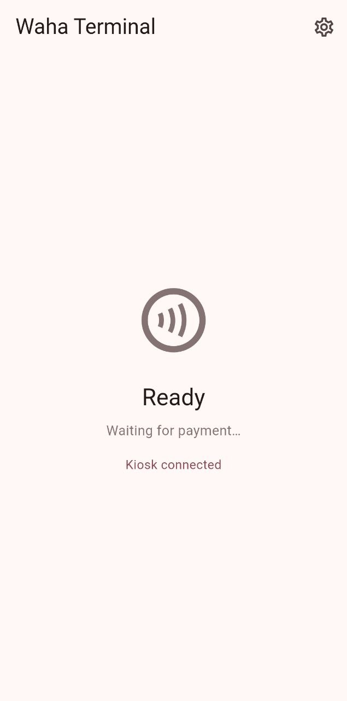
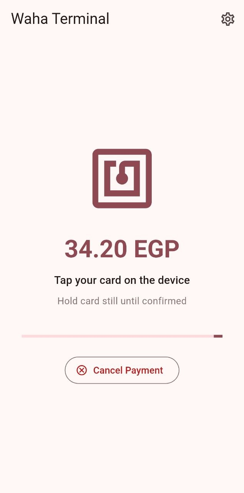
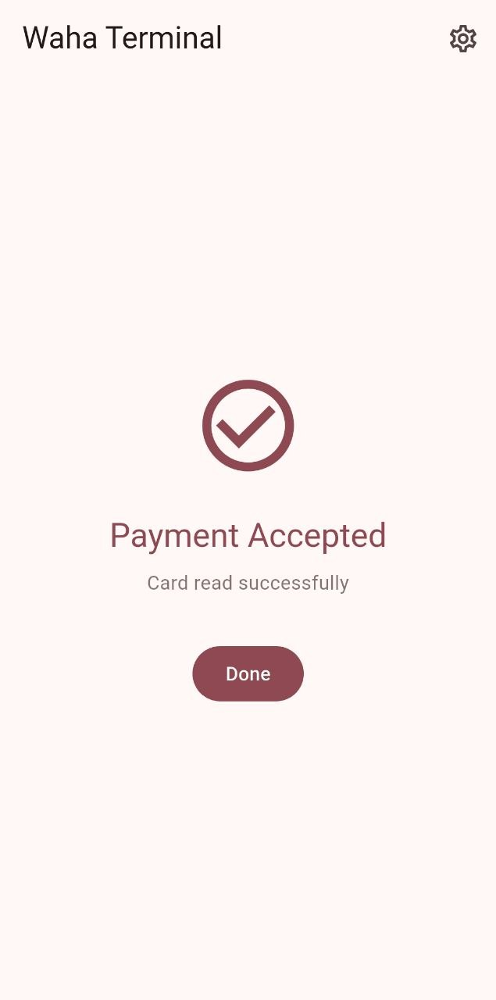
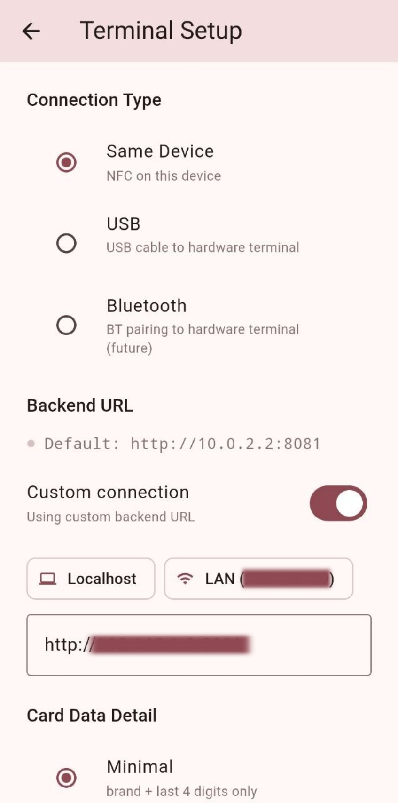
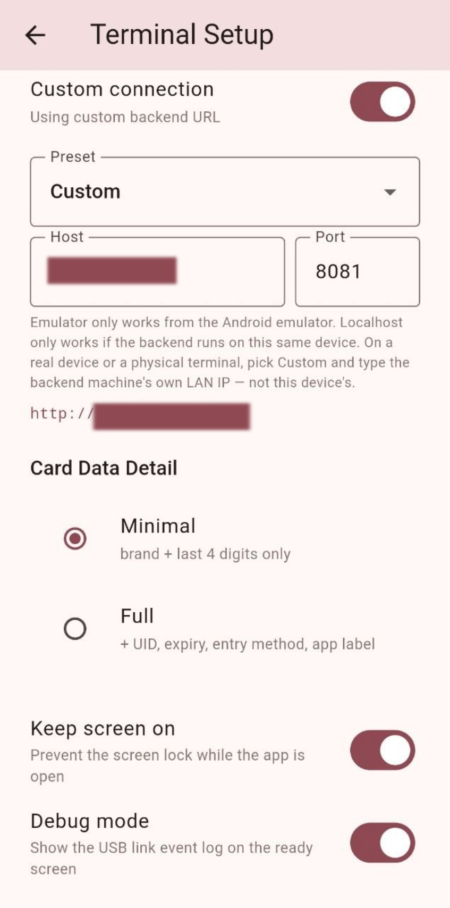
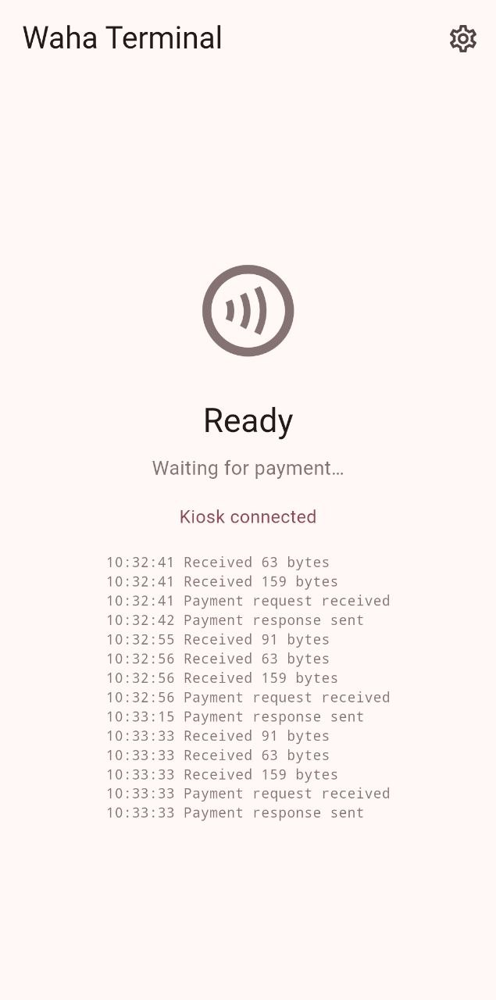

# Waha Terminal

Standalone Flutter (Android) app acting as a software POS terminal for Waha. It
runs alongside the Waha Kiosk — on the same device or a second one — and
handles card-present payment via NFC. The terminal can be linked to the kiosk
in two ways: over the network (backend polling) or directly over a USB cable.

<p>
  
  
  
</p>

## How it fits together

```
Network mode (Connection Type: Same Device)

[Waha Kiosk]  ──── HTTP ────►  [Waha Backend]  ◄──── HTTP ────  [Waha Terminal]
   customer UI                  Spring Boot          polls, reads NFC, confirms


USB mode (Connection Type: USB)

[Waha Kiosk]  ═══ USB cable ═══  [Waha Terminal]
  USB host, owns the payment       USB accessory (device), answers requests,
  session and talks to the backend reads NFC. No backend calls.
```

### Network mode

1. Customer picks "Pay by Terminal" on the kiosk.
2. Backend creates a payment session, status `PENDING_TERMINAL`.
3. This app polls the backend, shows the amount and "Tap your card".
4. The customer taps an NFC card; the app reads it and confirms to the backend.
5. Backend marks the session `PAID`; the kiosk picks it up on its next poll.
6. 90 s with no tap → the session times out, retry allowed.

### USB mode

The kiosk is the USB **host** and drives every step; this app is the USB
**device** (Android Open Accessory) and only answers.

1. The kiosk switches this phone into accessory mode, the phone re-enumerates,
   and the app opens the accessory.
2. Both sides exchange `hello`; before each payment the kiosk pings and
   requires a pong.
3. The kiosk sends `payment_request` (reference, amount, currency).
4. The terminal shows the amount and reads the NFC card, then answers with
   `payment_response` (approved / declined / error / cancelled).
5. The kiosk confirms or cancels the backend session itself. **In USB mode the
   terminal makes no backend calls and does no polling.**

Verified phone-to-phone with the kiosk app: link bring-up, repeated payments
over one link, and payment acceptance.

## USB link

### Setup

1. Install the app on the terminal phone and sign in.
2. **Settings → Connection Type → USB → Save & Connect.** (Save & Connect
   still validates the backend URL, even though USB mode does not use it.)
3. Connect the phones with a cable. The kiosk starts the accessory handshake;
   accept the system prompt "open Waha Terminal for this accessory".
4. The ready screen shows **Ready — Kiosk connected** once the handshake
   completes.

<p>
  
  
</p>

### Ready screen

In USB mode the ready screen is derived live from the platform, never from a
remembered flag, and only says **Ready** once the kiosk has said hello:

| Situation | Headline | Line under it |
|---|---|---|
| Kiosk hello done | **Ready** | Kiosk connected — waiting for payment |
| Cable detected, handshaking | Connecting… | USB linked — handshaking with the kiosk… |
| USB permission prompt pending | Connecting… | Accept the USB permission prompt on this phone |
| Permission denied / link error | Not connected | What happened, and to replug the cable |
| This phone became the USB host | Not connected | Explains the role swap or the USB-A fix |
| Nothing plugged in | Not connected | Plug the USB cable into the kiosk |

The state is re-read on start, after Save & Connect and when the app returns to
the foreground, so a missed event cannot leave the screen stale. After a
payment the result screen (accepted / cancelled / timed out / error) goes back
to the ready screen by itself after 4 seconds.

Cable notes:

- **USB-A end to USB-C:** the device on the A end is the host, so the kiosk
  goes on the A end and roles are deterministic. Between two phones, put a
  USB-C-to-A OTG adapter on the host (kiosk-side) phone.
- **USB-C to USB-C between two phones:** roles are negotiated and can come out
  backwards. The terminal then shows *"This phone is acting as the USB host"*;
  on Samsung use *USB controlled by → connected device*, or use a USB-A end on
  the kiosk side.
- Once in accessory mode, wired `adb` to the terminal phone drops. Use wireless
  adb for logs: `adb logcat -s WahaTerminal`.

### Wire protocol

Shared with the kiosk; the same `WahaLinkProtocol.kt` lives in both repos and
must stay byte-identical.

- Frame = 4-byte big-endian length + UTF-8 JSON (max 64 KB). A bad length or
  invalid JSON tears the link down; there is no resync.
- Accessory identity: manufacturer `Waha`, model `WahaTerminal`, version `1`.
- JSON key `type` (snake_case values), other fields camelCase, every message
  has an `id`. Messages: `hello`, `ping`, `pong`, `payment_request`,
  `payment_response`, `cancel`.
- The terminal answers **every** kiosk `hello` with its own `hello` and every
  `ping` with a `pong` (also while a payment is in flight).
- One payment at a time; a second `payment_request` gets `BUSY` without
  disturbing the first. `cancel` is answered immediately with `cancelled`.
- Amount is a decimal string in major units (e.g. `"34.20"`).
- Error codes: `NOT_CONNECTED`, `PERMISSION_DENIED`, `WRITE_FAILED`, `TIMEOUT`,
  `INVALID_RESPONSE`, `DECLINED`, `CANCELLED`, `BUSY`, `NFC_UNAVAILABLE`,
  `NFC_READ_FAILED`, `UNSUPPORTED_VERSION`.
- The kiosk owns the payment timeout (it cancels first); the terminal's own NFC
  read times out at 90 s.

### Design rules

- Connection state is always derived live from the platform, never from a
  cached flag; detach or any stream failure tears everything down at once.
- Card data, amounts, references and payloads are never logged. Lifecycle logs
  use the `WahaTerminal` tag.
- With **Settings → Debug mode** on (off by default) the ready screen lists
  the most recent link events with timestamps, so a screenshot shows where a
  run stopped.

  

- **Settings → Keep screen on** (on by default) stops the screen lock while the
  app is open, so NFC reading and the amount on screen are not lost to the
  screen timeout. It does not stop the power button.
- Result screens (accepted / cancelled / timed out / error) return to the ready
  screen by themselves after 4 seconds; **Done** dismisses them sooner.

## Running locally

Network mode needs a reachable Waha backend (default `http://10.0.2.2:8081`,
the Android emulator's alias for the host machine's `localhost`).

On a **real device** go to **Terminal Setup → Custom connection**, pick a
preset (Emulator / Localhost / Custom) and, for Custom, enter the backend
machine's LAN IP and port — not the phone's own IP. The value is saved and
reused on later launches.

```
flutter pub get
flutter run
```

### Tests

The shared codec and the terminal link logic have JVM unit tests (the link is
tested against a fake kiosk over in-memory pipes, no hardware needed):

```
cd android && ./gradlew :app:testDebugUnitTest
```

## Project layout

```
lib/
  main.dart
  screens/
    login_screen.dart        sign in
    home_screen.dart         idle / pending / result views, USB link status + log
    config_screen.dart       connection type, backend URL, card data detail
  services/
    api_client.dart          backend HTTP client (network mode)
    local_prefs.dart         persisted settings
    terminal_auth_service.dart
    nfc_service.dart         NFC poll + EMV read
    screen_service.dart      keep-screen-on (window flag via method channel)
    terminal_provider.dart   transport interface
    nfc_terminal_provider.dart
    usb_link_service.dart    Dart side of the USB accessory link
    usb_terminal_provider.dart   generic USB host-mode transport (not used by the kiosk link)
  state/
    terminal_state.dart      session state machine (network + USB modes)

android/app/src/main/
  kotlin/com/waha/link/WahaLinkProtocol.kt        shared codec (identical in the kiosk repo)
  kotlin/com/waha/waha_terminal/
    MainActivity.kt          method/event channels
    UsbAccessoryManager.kt   opens the accessory, permission, live state, teardown
    AccessoryLink.kt         protocol logic: hello, ping/pong, payment, cancel, BUSY
    UsbTerminalManager.kt    generic USB host-mode module (not used by the kiosk link)
  res/xml/accessory_filter.xml

android/app/src/test/kotlin/   codec + link unit tests
docs/screenshots/              images used in this README
```

## Related repos

- `waha` — Spring Boot backend, owns payment session state
- `waha_platform` — Waha Kiosk, customer-facing Flutter app and the USB host
  side of the link
